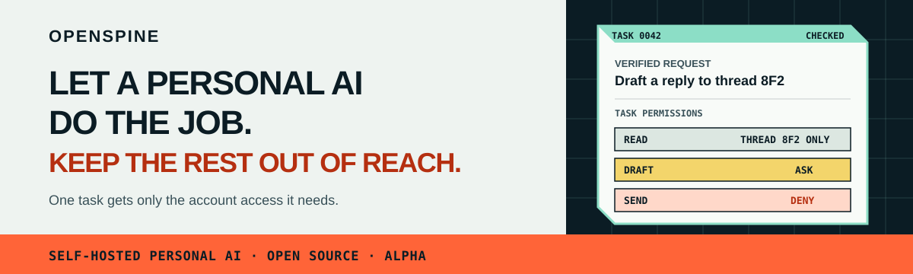
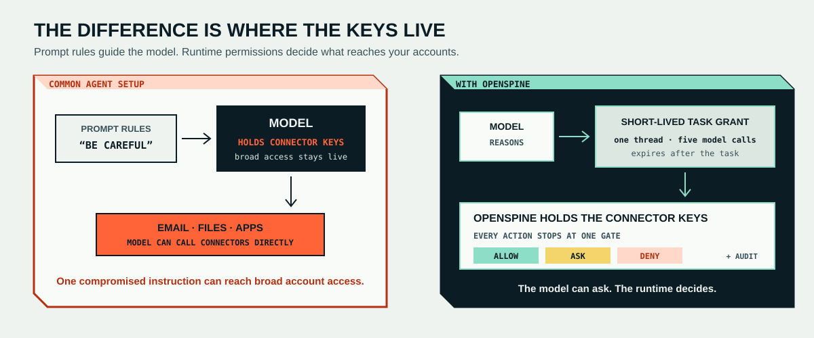
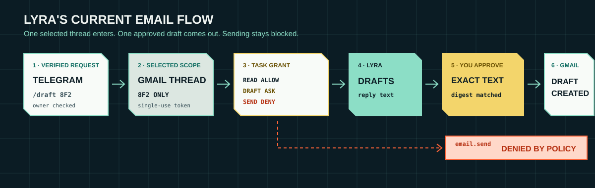

<picture>
  
</picture>

<p align="center">
  <a href="https://george-rd.github.io/openspine/"><strong>Website</strong></a>
  ·
  <a href="https://george-rd.github.io/openspine/comparison/"><strong>How it differs</strong></a>
  ·
  <a href="https://george-rd.github.io/openspine/quickstart/"><strong>Quickstart</strong></a>
  ·
  <a href="https://george-rd.github.io/openspine/threat-model/"><strong>Threat model</strong></a>
  ·
  <a href="https://george-rd.github.io/openspine/roadmap/"><strong>Roadmap</strong></a>
  ·
  <a href="https://ko-fi.com/george_builds"><strong>Support</strong></a>
</p>

# OpenSpine

**A self-hosted personal AI system for real account access.**

OpenSpine is the system you install. **Lyra is the assistant you talk to.** The runtime keeps your account keys away from the model. Each task gets short-lived limits. Before an account action runs, OpenSpine allows it, blocks it, or sends it to you first.

It does not run OpenClaw, Hermes, or another assistant inside OpenSpine today. Other assistant packages may come later. Lyra is the path that works now.

> **Alpha:** Lyra can read one Gmail thread you choose, draft a reply, and create the exact draft you approved. It cannot send the email.

## Why this needs a different system

A personal agent is easy to trust while it writes notes or works in a disposable folder. The decision changes when it asks for your main inbox, customer data, files, calendar, infrastructure, or another real account.

Now the failure scenes are concrete:

- a poisoned email tells the model to read more mail;
- the agent selects the wrong customer, thread, or account;
- a skill adds an extra recipient;
- a credential appears in tool output or chat history;
- an approval applies to something different from what you reviewed;
- the agent quietly gives itself more access.

Prompts, allowlists, approvals, and sandboxes all help. OpenSpine adds a harder rule: **the model is never the authority source.**

<picture>
  
</picture>

## The product shape

```text
you ↔ Lyra
       │ asks for work
       ▼
OpenSpine runtime
  verifies → scopes → grants → gates → records
       │
       ▼
email, models, and other connectors
```

- **Lyra** handles the conversation and coordinates bounded workers and workflows.
- **The runtime** verifies requests, builds the task grant, holds credentials, and checks actions.
- **Workers** receive a task token and the context needed for that job. They do not receive raw connector keys.
- **Connectors** run only after the gate returns allow or after an exact approval is satisfied.

The deterministic path is:

```text
event → verify → identify → route → compose → grant → run → gate → audit
```

A malicious email can change what the model tries to do. It cannot create permission to read another thread or send an email.

## How this differs from OpenClaw and Hermes

OpenClaw and Hermes are mature, capability-first personal agents. They offer far more channels, tools, skills, automation, and onboarding than OpenSpine does today. They also provide real security controls.

OpenSpine makes a different trade:

> **OpenClaw and Hermes are capability-first assistants. OpenSpine is a trust-first assistant system.**

The distinction is structural, not a claim that the other projects ignore security. OpenSpine makes task authority a first-class runtime object, keeps it outside the model, and treats every read, write, model call, connector call, and durable change as a gated effect.

See the [full comparison](https://george-rd.github.io/openspine/comparison/) for the current strengths and trade-offs of each approach.

## Lyra: the working proof

<picture>
  
</picture>

Today, you send Lyra a Gmail thread ID in Telegram. OpenSpine verifies the owner message and binds the task to that thread. Lyra prepares a reply. You approve the exact text and target before a Gmail draft is created. `email.send` remains denied.

This workflow is deliberately narrow. It proves the boundary against hostile external content without claiming that the alpha is already a full chief-of-staff assistant.

## Permissions grow only after you approve them

An agent can propose a new route, rule, workflow, skill, or capability. The proposal stays inactive until the relevant lifecycle and approval checks pass. Nothing can silently give itself more access.

The broader design aims to make safe repetition smoother: do internal work freely, ask at a real effect boundary, and turn repeated approvals into revocable standing rules only after one explicit decision.

## Proof you can run

Each documented security claim points to a named test. `scripts/check-claims.sh` fails the build if a listed test disappears.

| Runtime claim | Named test |
|---|---|
| A spoofed owner ID without a verified source is denied | `spoofed_owner_id_without_verified_source_is_denied` |
| A task cannot read a different Gmail thread | `email_read_selected_thread_rejects_foreign_grant` |
| The agent process receives no raw connector credentials | `process_driver_clears_env_and_sets_only_two_vars` |
| An explicit deny overrides an allow | `explicit_deny_overrides_allow` |
| Every effectful action stops at the gate before dispatch | `approval_required_action_stops_before_dispatch` |
| Email sending is denied in every grant and approval state | `global_policy_round_trips_and_denies_send` |

The [full claims register](docs/threat-claims.md) covers external content, model calls, approval binding, audit artifacts, host operations, and more.

## Current trade-offs

Choose the alpha because the authority model matters enough to accept:

- Docker, Telegram, model-provider, and Gmail OAuth setup;
- a copied Gmail thread ID instead of a polished picker;
- one narrow owner-facing workflow;
- fewer channels and tools than mature agent platforms;
- an architecture and threat model that are still evolving in public.

Do not choose it today if your main requirement is the widest assistant feature set or a consumer-grade setup flow.

## Build and run the checks

```sh
git clone https://github.com/George-RD/openspine.git
cd openspine
npm ci
cargo build --workspace
./scripts/check.sh
```

This runs formatting, lints, tests, strict OpenSpec validation, and the claims register used by CI. The [quickstart](https://george-rd.github.io/openspine/quickstart/) then covers Telegram, Gmail, and model setup.

## Run Lyra

For Telegram control and model replies, the server needs:

- `OPENSPINE_TELEGRAM_BOT_TOKEN`
- `OPENSPINE_ARTIFACT_KEY`, generated with `openssl rand -hex 32`
- credentials for Anthropic, OpenAI, or another compatible model provider

For Gmail drafting, follow the [Gmail setup guide](docs/gmail-setup.md). It adds the Google OAuth client, `OPENSPINE_GMAIL_CLIENT_SECRET`, `OPENSPINE_GMAIL_REFRESH_TOKEN`, and a `gmail:` block with your `mailbox_address`.

Copy `.env.example` to `.env` and put the secret values there. Set `DOCKER_GID` to the numeric group ID of `/var/run/docker.sock` (`stat -c '%g' /var/run/docker.sock` on Linux or `stat -f '%g' /var/run/docker.sock` on macOS). Then copy `openspine.docker.example.yaml` to `openspine.yaml` and set `owner.telegram_user_id` plus the Gmail fields.

Build the contained task worker, then start the kernel:

```sh
docker build --file Dockerfile.shell --tag openspine-shell:latest .
docker compose up --build
```

Compose mounts the Lyra package read-only and retains runtime state in `./data`. A one-shot initializer fixes that directory's ownership before the non-root kernel starts, so existing Compose data is preserved across upgrades. The bare-metal process driver is a development shortcut; `/draft` is refused unless `unsafe_allow_uncontained_private_data: true` is set in an isolated development config.

Then message your bot:

```text
/draft <gmail_thread_id>
```

## Documentation

| Document | What it covers |
|---|---|
| [Why OpenSpine](https://george-rd.github.io/openspine/why-openspine/) | The real-account trust gap and the boundary OpenSpine enforces. |
| [How OpenSpine differs](https://george-rd.github.io/openspine/comparison/) | A fair comparison with capability-first personal agents. |
| [Architecture](https://george-rd.github.io/openspine/architecture/) | The event path, task grants, gate, artifacts, and audit model. |
| [`docs/threat-claims.md`](docs/threat-claims.md) | Every security claim and the test or manual proof behind it. |
| [`.raw/openspine-positioning-audit-2026-07-30.md`](.raw/openspine-positioning-audit-2026-07-30.md) | The Growth Arsenal offer audit, target market, value equation, and product contradictions. |
| [`.raw/openspine-decision-log.md`](.raw/openspine-decision-log.md) | Architecture decisions, consequences, and reversal conditions. |
| [`openspec/openspine-change-sequence.md`](openspec/openspine-change-sequence.md) | What has landed, what comes next, and the order of work. |

## Status

Alpha. The OpenSpine system and Lyra run end to end for verified owner control, scoped Gmail reads, reply previews, digest-bound draft approval, gated actions, and governed changes. The [change sequence](openspec/openspine-change-sequence.md) records runtime work that has landed. The [roadmap](https://george-rd.github.io/openspine/roadmap/) separates that from the owner-facing product work still missing.

## License

Free to use. MIT or Apache 2.0, whichever suits you.