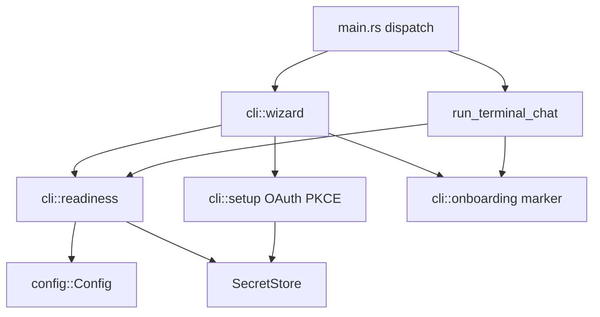

# Design: First-run onboarding

## Problem

Onboarding is stubbed. The commands exist in the clap surface, so the failure is
silent: `openspine setup` returns exit code 0 after printing a banner, which
reads as success. The owner then runs `openspine`, lands in a chat prompt, and
has no way to learn what is configured.

## Shape

Three small modules under `crates/openspine-kernel/src/cli/`, with `main.rs`
holding only command dispatch.

- `cli::readiness` is pure assessment. It takes a config path, an environment
  lookup closure, and an optional vault handle, and returns an ordered list of
  checks. No I/O beyond reading the config file and the vault.
- `cli::onboarding` owns the completion marker and the text shown at first chat
  start.
- `cli::wizard` owns interaction: prompts, menu, and the calls into
  `cli::setup`.

## Key decisions

### Readiness drives the notice, not the marker alone

Gating the first-run notice on a marker file alone would nag every existing
working install exactly once, and would stay silent on an install that is broken
but previously marked. The rule is:

- Not ready: print the blocking checks and their remedies every start, and do
  not write the marker.
- Ready and unmarked: print a short orientation once, then write the marker.
- Ready and marked: print nothing.

The marker is runtime state, so it lives at `<data_dir>/onboarding.json`, not in
`openspine.yaml`. `Config` uses `deny_unknown_fields`, and configuration is the
owner's file to edit; the kernel should not write bookkeeping into it.

### The environment lookup is injected

`config::artifact_key_bytes` and friends read `std::env` directly, which makes
process-global mutation the only way to test them. `readiness::assess` takes
`&dyn Fn(&str) -> Option<String>` instead, so every check is testable without
touching the ambient environment and without serializing tests.

### The starter configuration is embedded, not copied

`flake.nix` installs only `artifacts/lyra` into `share/openspine/lyra`. A
repo-root template is absent from an installed binary, and the repo root
template the README names no longer exists. The wizard therefore formats an
embedded template.

`lyra_dir` resolves from `std::env::current_exe()` as
`<exe_dir>/../share/openspine/lyra`, falling back to `artifacts/lyra` for a
development build. This tracks the running binary, so an upgrade cannot leave
the configuration pointing at a package directory that the previous generation
owned.

### Verification precedes role binding

`update_openspine_yaml_roles` runs only after
`run_preflight_verification_ping` returns true, which is what the
`model-provider-oauth-onboarding` spec already requires. A failed ping leaves
the vault credential in place and the configuration untouched, so a retry does
not have to redo the authorization.

### The wizard takes the data-root lock

`overlay_export_restore::acquire` resolves the canonical data root, which is the
only correct source for the credentials directory, and it is also the mutual
exclusion the kernel uses. Taking it means the wizard cannot write the vault
underneath a running kernel. When the lock is held, the wizard reports the
running instance and stops rather than opening a second view of the same state.

### Remedies are matched on the failure, not guessed at the call site

`readiness::startup_remedy` maps a startup error to a remedy line. Errors are
matched on their rendered chain, because the underlying failures are
`std::io::Error` and `anyhow` context strings raised across four subsystems, and
introducing a typed startup error enum across all of them is a larger change
than the remedy text justifies. The match is covered by tests that build the
real error values.

## Rejected alternatives

- **A vault-backed API key path.** Pasting an API key into the vault would need
  `provider_api_key` and `ProviderClient::from_config` to learn a second
  resolution order, which is a model gateway change wearing an onboarding
  disguise. Readiness names the environment variable instead.
- **A first-run flag in `openspine.yaml`.** Rejected above: the kernel would be
  rewriting the owner's configuration file to record its own state.
- **Running the wizard automatically on first chat.** An interactive
  authorization flow that starts without being asked is the wrong default for a
  tool whose posture is that the owner approves effects. Chat reports and points
  at `openspine setup`.
